# CESE - Sistemas Operativos de Tiempo Real II

## Trabajo Práctico N° 3 - Task Scheduling

### Actividad 02 - Rate Monotonic

> Proyecto basado en la plantilla `sotri-cooperative`. Para esta actividad se modifica FreeRTOS a modo preemptivo y se asignan prioridades fijas según Rate Monotonic.

## Datos de la entrega

| Campo | Valor |
|---|---|
| Materia | CESE - Sistemas Operativos de Tiempo Real II |
| Trabajo práctico | TP3 - Task Scheduling |
| Actividad | 02 - Rate Monotonic |
| Archivo de entrega | `sotrii-tp3_02-rate_monolitic.md` |
| Documentación general | `README.md` |
| Control de versiones | Git + GitHub |

## Criterios usados

- Factor de uso: `U = Σ(Ci/Ti)`.
- Hiperperíodo: `H = mcm(T1, T2, ...)`.
- **Período secundario:** `f = mcd(T1, T2, ...)`. En el ejecutivo cíclico `f` es el tamaño de trama. Rate Monotonic **no planifica por tramas**; el valor se informa porque el enunciado lo pide, no porque RM lo use.
- Prioridades RM: menor período => mayor prioridad.
- Test suficiente por utilización de Liu & Layland: `U <= N(2^(1/N)-1)`.
- Si el test de utilización no garantiza el sistema, se aplica el análisis exacto de tiempo de respuesta: `Ri = Ci + Σ ceil(Ri/Tj) Cj` para tareas de mayor prioridad.
- Como el enunciado usa `T = D`, cada respuesta debe cumplir `Ri <= Ti`.

## Configuración FreeRTOS para Rate Monotonic

Rate Monotonic exige un planificador **preemptivo**, **prioridades fijas** (inversas al período) y **liberaciones periódicas** con período constante. En FreeRTOS eso se traduce a:

| Configuración / API | Valor | Motivo para RMS |
|---|---|---|
| `configUSE_PREEMPTION` | `1` | Una tarea de menor período (mayor prioridad) debe desalojar a una de mayor período. Con `0` el scheduler es cooperativo y deja de ser RM. |
| `configTICK_RATE_HZ` | `1000` | Tick de 1 ms. Permite mapear `1 unidad del TP = 20 ms` sin perder la relación `C/T`. |
| `INCLUDE_vTaskDelayUntil` | `1` | Activación periódica absoluta. `vTaskDelay()` mediría desde el fin del trabajo y acumularía deriva. |
| Prioridad al crear la tarea | `tskIDLE_PRIORITY + N … + 1` | En FreeRTOS **el número más alto gana**. Menor `T` => mayor número. Las prioridades son estáticas (no se llama a `vTaskPrioritySet`). |
| `configUSE_TIME_SLICING` | `1` (valor por defecto) | No altera RM: cada tarea tiene prioridad distinta, no hay round-robin entre ellas. |
| Recursos compartidos | no usados | Las tareas son independientes; no hay inversión de prioridad. |

Otras decisiones de la demostración:

- Escala: `1 unidad del TP = 20 ms` (el sistema 4 representa `C1 = 0.5` como 10 ms).
- El WCET se simula con el contador DWT en un busy-loop que **no deshabilita interrupciones**, para que una tarea de mayor prioridad pueda preemptir.
- Código: `Core/Inc/FreeRTOSConfig.h` y `app/src/app.c`.

Los **cuatro sistemas del enunciado** están en `app/src/app.c`. Solo uno se compila y corre por vez (no corren en paralelo). El enunciado no fija la duración de una unidad; se usa `20 ms` para conservar `C/T/D` y poder representar `C = 0.5` del sistema 4 como `10 ms`.

Para elegir sistema, editar:

```c
#define TP3_RM_SYSTEM 1u
```

Valores válidos: `1`, `2`, `3` o `4`. Recompilar y programar la placa después de cambiarlo.

| `TP3_RM_SYSTEM` | Tareas | C, T = D (enunciado) | En placa (1 u = 20 ms) |
|---|---|---|---|
| `1` | T1, T2, T3 | 1/4, 2/5, 5/20 | 20/80, 40/100, 100/400 ms |
| `2` | T1, T2, T3 | 1/6, 2/10, 2/18 | 20/120, 40/200, 40/360 ms |
| `3` | T1–T4 | 1/8, 3/15, 4/20, 6/22 | 20/160, 60/300, 80/400, 120/440 ms |
| `4` | T1–T4 | 0.5/4, 1/5, 2/10, 9/24 | 10/80, 20/100, 40/200, 180/480 ms |

En los sistemas 1 y 2 no existe T4: `g_rm_exec_cnt[3]` permanece en 0.

## Sistema 1

| Tarea | C | T = D | Prioridad RM | Ui |
|---|---:|---:|---:|---:|
| T1 | 1 | 4 | 3 | 0.2500 |
| T2 | 2 | 5 | 2 | 0.4000 |
| T3 | 5 | 20 | 1 | 0.2500 |

**Factor de uso:** `U = 0.900000 = 90.00%`.  
**Hiperperíodo:** `H = mcm(4, 5, 20) = 20`.  
**Período secundario:** `f = mcd(4, 5, 20) = 1` (informado por el enunciado; RM no usa tramas).

### Test de garantía por factor de utilización

Para `N = 3`:

`U_RM = N(2^(1/N)-1) = 0.779763 = 77.98%`.

Como `U = 0.900000 > 0.779763`, el test de utilización **no garantiza** el sistema. Esto no significa que sea no planificable; se continúa con análisis de tiempo de respuesta.

### Análisis de tiempo de respuesta

| Tarea | Iteraciones | R | D | Resultado |
|---|---|---:|---:|---|
| T1 | `1 → 1` | 1 | 4 | **Cumple** |
| T2 | `2 → 3 → 3` | 3 | 5 | **Cumple** |
| T3 | `5 → 9 → 12 → 14 → 15 → 15` | 15 | 20 | **Cumple** |

**Conclusión Sistema 1:** todas las tareas cumplen `Ri <= Di`; el sistema es planificable con Rate Monotonic.

### Diagrama de Gantt (un hiperperíodo)

Eje en unidades del enunciado. T2 se parte en `t = 16` porque llega T1 (mayor prioridad). Debajo, la misma planificación en tabla.

```mermaid
gantt
    title Sistema 1 - Rate Monotonic (H = 20)
    dateFormat X
    axisFormat %s
    section T1
    T1 :t10, 0, 1
    T1 :t11, 4, 1
    T1 :t12, 8, 1
    T1 :t13, 12, 1
    T1 :t14, 16, 1
    section T2
    T2 :t20, 1, 2
    T2 :t21, 5, 2
    T2 :t22, 10, 2
    T2 :t23, 15, 1
    T2 :t24, 17, 1
    section T3
    T3 :t30, 3, 1
    T3 :t31, 7, 1
    T3 :t32, 9, 1
    T3 :t33, 13, 2
```



#### Tabla de intervalos

| Intervalo | CPU |
|---:|---|
| 0 - 1 | T1 |
| 1 - 3 | T2 |
| 3 - 4 | T3 |
| 4 - 5 | T1 |
| 5 - 7 | T2 |
| 7 - 8 | T3 |
| 8 - 9 | T1 |
| 9 - 10 | T3 |
| 10 - 12 | T2 |
| 12 - 13 | T1 |
| 13 - 15 | T3 |
| 15 - 16 | T2 |
| 16 - 17 | T1 |
| 17 - 18 | T2 |
| 18 - 20 | Idle |

## Sistema 2

| Tarea | C | T = D | Prioridad RM | Ui |
|---|---:|---:|---:|---:|
| T1 | 1 | 6 | 3 | 0.1667 |
| T2 | 2 | 10 | 2 | 0.2000 |
| T3 | 2 | 18 | 1 | 0.1111 |

**Factor de uso:** `U = 0.477778 = 47.78%`.  
**Hiperperíodo:** `H = mcm(6, 10, 18) = 90`.  
**Período secundario:** `f = mcd(6, 10, 18) = 2` (informado por el enunciado; RM no usa tramas).

### Test de garantía por factor de utilización

Para `N = 3`:

`U_RM = N(2^(1/N)-1) = 0.779763 = 77.98%`.

Como `U = 0.477778 <= 0.779763`, el sistema **cumple el test suficiente de utilización y queda garantizado por este test**.

### Análisis de tiempo de respuesta

| Tarea | Iteraciones | R | D | Resultado |
|---|---|---:|---:|---|
| T1 | `1 → 1` | 1 | 6 | **Cumple** |
| T2 | `2 → 3 → 3` | 3 | 10 | **Cumple** |
| T3 | `2 → 5 → 5` | 5 | 18 | **Cumple** |

**Conclusión Sistema 2:** todas las tareas cumplen `Ri <= Di`; el sistema es planificable con Rate Monotonic.

### Diagrama de Gantt (un hiperperíodo)

Eje en unidades del enunciado. T3 se parte en `t = 20` porque llega T2 (mayor prioridad). Debajo, la misma planificación en tabla.

```mermaid
gantt
    title Sistema 2 - Rate Monotonic (H = 90)
    dateFormat X
    axisFormat %s
    section T1
    T1 :t10, 0, 1
    T1 :t11, 6, 1
    T1 :t12, 12, 1
    T1 :t13, 18, 1
    T1 :t14, 24, 1
    T1 :t15, 30, 1
    T1 :t16, 36, 1
    T1 :t17, 42, 1
    T1 :t18, 48, 1
    T1 :t19, 54, 1
    T1 :t110, 60, 1
    T1 :t111, 66, 1
    T1 :t112, 72, 1
    T1 :t113, 78, 1
    T1 :t114, 84, 1
    section T2
    T2 :t20, 1, 2
    T2 :t21, 10, 2
    T2 :t22, 20, 2
    T2 :t23, 31, 2
    T2 :t24, 40, 2
    T2 :t25, 50, 2
    T2 :t26, 61, 2
    T2 :t27, 70, 2
    T2 :t28, 80, 2
    section T3
    T3 :t30, 3, 2
    T3 :t31, 19, 1
    T3 :t32, 22, 1
    T3 :t33, 37, 2
    T3 :t34, 55, 2
    T3 :t35, 73, 2
```



#### Tabla de intervalos

| Intervalo | CPU |
|---:|---|
| 0 - 1 | T1 |
| 1 - 3 | T2 |
| 3 - 5 | T3 |
| 5 - 6 | Idle |
| 6 - 7 | T1 |
| 7 - 10 | Idle |
| 10 - 12 | T2 |
| 12 - 13 | T1 |
| 13 - 18 | Idle |
| 18 - 19 | T1 |
| 19 - 20 | T3 |
| 20 - 22 | T2 |
| 22 - 23 | T3 |
| 23 - 24 | Idle |
| 24 - 25 | T1 |
| 25 - 30 | Idle |
| 30 - 31 | T1 |
| 31 - 33 | T2 |
| 33 - 36 | Idle |
| 36 - 37 | T1 |
| 37 - 39 | T3 |
| 39 - 40 | Idle |
| 40 - 42 | T2 |
| 42 - 43 | T1 |
| 43 - 48 | Idle |
| 48 - 49 | T1 |
| 49 - 50 | Idle |
| 50 - 52 | T2 |
| 52 - 54 | Idle |
| 54 - 55 | T1 |
| 55 - 57 | T3 |
| 57 - 60 | Idle |
| 60 - 61 | T1 |
| 61 - 63 | T2 |
| 63 - 66 | Idle |
| 66 - 67 | T1 |
| 67 - 70 | Idle |
| 70 - 72 | T2 |
| 72 - 73 | T1 |
| 73 - 75 | T3 |
| 75 - 78 | Idle |
| 78 - 79 | T1 |
| 79 - 80 | Idle |
| 80 - 82 | T2 |
| 82 - 84 | Idle |
| 84 - 85 | T1 |
| 85 - 90 | Idle |

## Sistema 3

| Tarea | C | T = D | Prioridad RM | Ui |
|---|---:|---:|---:|---:|
| T1 | 1 | 8 | 4 | 0.1250 |
| T2 | 3 | 15 | 3 | 0.2000 |
| T3 | 4 | 20 | 2 | 0.2000 |
| T4 | 6 | 22 | 1 | 0.2727 |

**Factor de uso:** `U = 0.797727 = 79.77%`.  
**Hiperperíodo:** `H = mcm(8, 15, 20, 22) = 1320`.  
**Período secundario:** `f = mcd(8, 15, 20, 22) = 1` (informado por el enunciado; RM no usa tramas).

### Test de garantía por factor de utilización

Para `N = 4`:

`U_RM = N(2^(1/N)-1) = 0.756828 = 75.68%`.

Como `U = 0.797727 > 0.756828`, el test de utilización **no garantiza** el sistema. Esto no significa que sea no planificable; se continúa con análisis de tiempo de respuesta.

### Análisis de tiempo de respuesta

| Tarea | Iteraciones | R | D | Resultado |
|---|---|---:|---:|---|
| T1 | `1 → 1` | 1 | 8 | **Cumple** |
| T2 | `3 → 4 → 4` | 4 | 15 | **Cumple** |
| T3 | `4 → 8 → 8` | 8 | 20 | **Cumple** |
| T4 | `6 → 14 → 15 → 15` | 15 | 22 | **Cumple** |

**Conclusión Sistema 3:** todas las tareas cumplen `Ri <= Di`; el sistema es planificable con Rate Monotonic.

### Diagrama de Gantt (un hiperperíodo)

El hiperperíodo es `H = 1320`; el gráfico muestra la ventana `[0, 80]` (preempciones de T2 y T4 incluidas). La tabla siguiente cubre el hiperperíodo completo.

```mermaid
gantt
    title Sistema 3 - Rate Monotonic (ventana 0-80 de H = 1320)
    dateFormat X
    axisFormat %s
    section T1
    T1 :t10, 0, 1
    T1 :t11, 8, 1
    T1 :t12, 16, 1
    T1 :t13, 24, 1
    T1 :t14, 32, 1
    T1 :t15, 40, 1
    T1 :t16, 48, 1
    T1 :t17, 56, 1
    T1 :t18, 64, 1
    T1 :t19, 72, 1
    section T2
    T2 :t20, 1, 3
    T2 :t21, 15, 1
    T2 :t22, 17, 2
    T2 :t23, 30, 2
    T2 :t24, 33, 1
    T2 :t25, 45, 3
    T2 :t26, 60, 3
    T2 :t27, 75, 3
    section T3
    T3 :t30, 4, 4
    T3 :t31, 20, 4
    T3 :t32, 41, 4
    T3 :t33, 63, 1
    T3 :t34, 65, 3
    section T4
    T4 :t40, 9, 6
    T4 :t41, 25, 5
    T4 :t42, 34, 1
    T4 :t43, 49, 6
    T4 :t44, 68, 4
    T4 :t45, 73, 2
```



#### Tabla de intervalos (hiperperíodo completo)

| Intervalo | CPU |
|---:|---|
| 0 - 1 | T1 |
| 1 - 4 | T2 |
| 4 - 8 | T3 |
| 8 - 9 | T1 |
| 9 - 15 | T4 |
| 15 - 16 | T2 |
| 16 - 17 | T1 |
| 17 - 19 | T2 |
| 19 - 20 | Idle |
| 20 - 24 | T3 |
| 24 - 25 | T1 |
| 25 - 30 | T4 |
| 30 - 32 | T2 |
| 32 - 33 | T1 |
| 33 - 34 | T2 |
| 34 - 35 | T4 |
| 35 - 40 | Idle |
| 40 - 41 | T1 |
| 41 - 45 | T3 |
| 45 - 48 | T2 |
| 48 - 49 | T1 |
| 49 - 55 | T4 |
| 55 - 56 | Idle |
| 56 - 57 | T1 |
| 57 - 60 | Idle |
| 60 - 63 | T2 |
| 63 - 64 | T3 |
| 64 - 65 | T1 |
| 65 - 68 | T3 |
| 68 - 72 | T4 |
| 72 - 73 | T1 |
| 73 - 75 | T4 |
| 75 - 78 | T2 |
| 78 - 80 | Idle |
| 80 - 81 | T1 |
| 81 - 85 | T3 |
| 85 - 88 | Idle |
| 88 - 89 | T1 |
| 89 - 90 | T4 |
| 90 - 93 | T2 |
| 93 - 96 | T4 |
| 96 - 97 | T1 |
| 97 - 99 | T4 |
| 99 - 100 | Idle |
| 100 - 104 | T3 |
| 104 - 105 | T1 |
| 105 - 108 | T2 |
| 108 - 110 | Idle |
| 110 - 112 | T4 |
| 112 - 113 | T1 |
| 113 - 117 | T4 |
| 117 - 120 | Idle |
| 120 - 121 | T1 |
| 121 - 124 | T2 |
| 124 - 128 | T3 |
| 128 - 129 | T1 |
| 129 - 132 | Idle |
| 132 - 135 | T4 |
| 135 - 136 | T2 |
| 136 - 137 | T1 |
| 137 - 139 | T2 |
| 139 - 140 | T4 |
| 140 - 144 | T3 |
| 144 - 145 | T1 |
| 145 - 147 | T4 |
| 147 - 150 | Idle |
| 150 - 152 | T2 |
| 152 - 153 | T1 |
| 153 - 154 | T2 |
| 154 - 160 | T4 |
| 160 - 161 | T1 |
| 161 - 165 | T3 |
| 165 - 168 | T2 |
| 168 - 169 | T1 |
| 169 - 176 | Idle |
| 176 - 177 | T1 |
| 177 - 180 | T4 |
| 180 - 183 | T2 |
| 183 - 184 | T3 |
| 184 - 185 | T1 |
| 185 - 188 | T3 |
| 188 - 191 | T4 |
| 191 - 192 | Idle |
| 192 - 193 | T1 |
| 193 - 195 | Idle |
| 195 - 198 | T2 |
| 198 - 200 | T4 |
| 200 - 201 | T1 |
| 201 - 205 | T3 |
| 205 - 208 | T4 |
| 208 - 209 | T1 |
| 209 - 210 | T4 |
| 210 - 213 | T2 |
| 213 - 216 | Idle |
| 216 - 217 | T1 |
| 217 - 220 | Idle |
| 220 - 224 | T3 |
| 224 - 225 | T1 |
| 225 - 228 | T2 |
| 228 - 232 | T4 |
| 232 - 233 | T1 |
| 233 - 235 | T4 |
| 235 - 240 | Idle |
| 240 - 241 | T1 |
| 241 - 244 | T2 |
| 244 - 248 | T3 |
| 248 - 249 | T1 |
| 249 - 255 | T4 |
| 255 - 256 | T2 |
| 256 - 257 | T1 |
| 257 - 259 | T2 |
| 259 - 260 | Idle |
| 260 - 264 | T3 |
| 264 - 265 | T1 |
| 265 - 270 | T4 |
| 270 - 272 | T2 |
| 272 - 273 | T1 |
| 273 - 274 | T2 |
| 274 - 275 | T4 |
| 275 - 280 | Idle |
| 280 - 281 | T1 |
| 281 - 285 | T3 |
| 285 - 288 | T2 |
| 288 - 289 | T1 |
| 289 - 295 | T4 |
| 295 - 296 | Idle |
| 296 - 297 | T1 |
| 297 - 300 | Idle |
| 300 - 303 | T2 |
| 303 - 304 | T3 |
| 304 - 305 | T1 |
| 305 - 308 | T3 |
| 308 - 312 | T4 |
| 312 - 313 | T1 |
| 313 - 315 | T4 |
| 315 - 318 | T2 |
| 318 - 320 | Idle |
| 320 - 321 | T1 |
| 321 - 325 | T3 |
| 325 - 328 | Idle |
| 328 - 329 | T1 |
| 329 - 330 | Idle |
| 330 - 333 | T2 |
| 333 - 336 | T4 |
| 336 - 337 | T1 |
| 337 - 340 | T4 |
| 340 - 344 | T3 |
| 344 - 345 | T1 |
| 345 - 348 | T2 |
| 348 - 352 | Idle |
| 352 - 353 | T1 |
| 353 - 359 | T4 |
| 359 - 360 | Idle |
| 360 - 361 | T1 |
| 361 - 364 | T2 |
| 364 - 368 | T3 |
| 368 - 369 | T1 |
| 369 - 374 | Idle |
| 374 - 375 | T4 |
| 375 - 376 | T2 |
| 376 - 377 | T1 |
| 377 - 379 | T2 |
| 379 - 380 | T4 |
| 380 - 384 | T3 |
| 384 - 385 | T1 |
| 385 - 389 | T4 |
| 389 - 390 | Idle |
| 390 - 392 | T2 |
| 392 - 393 | T1 |
| 393 - 394 | T2 |
| 394 - 396 | Idle |
| 396 - 400 | T4 |
| 400 - 401 | T1 |
| 401 - 405 | T3 |
| 405 - 408 | T2 |
| 408 - 409 | T1 |
| 409 - 411 | T4 |
| 411 - 416 | Idle |
| 416 - 417 | T1 |
| 417 - 418 | Idle |
| 418 - 420 | T4 |
| 420 - 423 | T2 |
| 423 - 424 | T3 |
| 424 - 425 | T1 |
| 425 - 428 | T3 |
| 428 - 432 | T4 |
| 432 - 433 | T1 |
| 433 - 435 | Idle |
| 435 - 438 | T2 |
| 438 - 440 | Idle |
| 440 - 441 | T1 |
| 441 - 445 | T3 |
| 445 - 448 | T4 |
| 448 - 449 | T1 |
| 449 - 450 | T4 |
| 450 - 453 | T2 |
| 453 - 455 | T4 |
| 455 - 456 | Idle |
| 456 - 457 | T1 |
| 457 - 460 | Idle |
| 460 - 464 | T3 |
| 464 - 465 | T1 |
| 465 - 468 | T2 |
| 468 - 472 | T4 |
| 472 - 473 | T1 |
| 473 - 475 | T4 |
| 475 - 480 | Idle |
| 480 - 481 | T1 |
| 481 - 484 | T2 |
| 484 - 488 | T3 |
| 488 - 489 | T1 |
| 489 - 495 | T4 |
| 495 - 496 | T2 |
| 496 - 497 | T1 |
| 497 - 499 | T2 |
| 499 - 500 | Idle |
| 500 - 504 | T3 |
| 504 - 505 | T1 |
| 505 - 506 | Idle |
| 506 - 510 | T4 |
| 510 - 512 | T2 |
| 512 - 513 | T1 |
| 513 - 514 | T2 |
| 514 - 516 | T4 |
| 516 - 520 | Idle |
| 520 - 521 | T1 |
| 521 - 525 | T3 |
| 525 - 528 | T2 |
| 528 - 529 | T1 |
| 529 - 535 | T4 |
| 535 - 536 | Idle |
| 536 - 537 | T1 |
| 537 - 540 | Idle |
| 540 - 543 | T2 |
| 543 - 544 | T3 |
| 544 - 545 | T1 |
| 545 - 548 | T3 |
| 548 - 550 | Idle |
| 550 - 552 | T4 |
| 552 - 553 | T1 |
| 553 - 555 | T4 |
| 555 - 558 | T2 |
| 558 - 560 | T4 |
| 560 - 561 | T1 |
| 561 - 565 | T3 |
| 565 - 568 | Idle |
| 568 - 569 | T1 |
| 569 - 570 | Idle |
| 570 - 573 | T2 |
| 573 - 576 | T4 |
| 576 - 577 | T1 |
| 577 - 580 | T4 |
| 580 - 584 | T3 |
| 584 - 585 | T1 |
| 585 - 588 | T2 |
| 588 - 592 | Idle |
| 592 - 593 | T1 |
| 593 - 594 | Idle |
| 594 - 600 | T4 |
| 600 - 601 | T1 |
| 601 - 604 | T2 |
| 604 - 608 | T3 |
| 608 - 609 | T1 |
| 609 - 615 | Idle |
| 615 - 616 | T2 |
| 616 - 617 | T1 |
| 617 - 619 | T2 |
| 619 - 620 | T4 |
| 620 - 624 | T3 |
| 624 - 625 | T1 |
| 625 - 630 | T4 |
| 630 - 632 | T2 |
| 632 - 633 | T1 |
| 633 - 634 | T2 |
| 634 - 638 | Idle |
| 638 - 640 | T4 |
| 640 - 641 | T1 |
| 641 - 645 | T3 |
| 645 - 648 | T2 |
| 648 - 649 | T1 |
| 649 - 653 | T4 |
| 653 - 656 | Idle |
| 656 - 657 | T1 |
| 657 - 660 | Idle |
| 660 - 663 | T2 |
| 663 - 664 | T3 |
| 664 - 665 | T1 |
| 665 - 668 | T3 |
| 668 - 672 | T4 |
| 672 - 673 | T1 |
| 673 - 675 | T4 |
| 675 - 678 | T2 |
| 678 - 680 | Idle |
| 680 - 681 | T1 |
| 681 - 685 | T3 |
| 685 - 688 | T4 |
| 688 - 689 | T1 |
| 689 - 690 | T4 |
| 690 - 693 | T2 |
| 693 - 695 | T4 |
| 695 - 696 | Idle |
| 696 - 697 | T1 |
| 697 - 700 | Idle |
| 700 - 704 | T3 |
| 704 - 705 | T1 |
| 705 - 708 | T2 |
| 708 - 712 | T4 |
| 712 - 713 | T1 |
| 713 - 715 | T4 |
| 715 - 720 | Idle |
| 720 - 721 | T1 |
| 721 - 724 | T2 |
| 724 - 728 | T3 |
| 728 - 729 | T1 |
| 729 - 735 | T4 |
| 735 - 736 | T2 |
| 736 - 737 | T1 |
| 737 - 739 | T2 |
| 739 - 740 | Idle |
| 740 - 744 | T3 |
| 744 - 745 | T1 |
| 745 - 748 | Idle |
| 748 - 750 | T4 |
| 750 - 752 | T2 |
| 752 - 753 | T1 |
| 753 - 754 | T2 |
| 754 - 758 | T4 |
| 758 - 760 | Idle |
| 760 - 761 | T1 |
| 761 - 765 | T3 |
| 765 - 768 | T2 |
| 768 - 769 | T1 |
| 769 - 770 | Idle |
| 770 - 776 | T4 |
| 776 - 777 | T1 |
| 777 - 780 | Idle |
| 780 - 783 | T2 |
| 783 - 784 | T3 |
| 784 - 785 | T1 |
| 785 - 788 | T3 |
| 788 - 792 | Idle |
| 792 - 793 | T1 |
| 793 - 795 | T4 |
| 795 - 798 | T2 |
| 798 - 800 | T4 |
| 800 - 801 | T1 |
| 801 - 805 | T3 |
| 805 - 807 | T4 |
| 807 - 808 | Idle |
| 808 - 809 | T1 |
| 809 - 810 | Idle |
| 810 - 813 | T2 |
| 813 - 814 | Idle |
| 814 - 816 | T4 |
| 816 - 817 | T1 |
| 817 - 820 | T4 |
| 820 - 824 | T3 |
| 824 - 825 | T1 |
| 825 - 828 | T2 |
| 828 - 829 | T4 |
| 829 - 832 | Idle |
| 832 - 833 | T1 |
| 833 - 836 | Idle |
| 836 - 840 | T4 |
| 840 - 841 | T1 |
| 841 - 844 | T2 |
| 844 - 848 | T3 |
| 848 - 849 | T1 |
| 849 - 851 | T4 |
| 851 - 855 | Idle |
| 855 - 856 | T2 |
| 856 - 857 | T1 |
| 857 - 859 | T2 |
| 859 - 860 | T4 |
| 860 - 864 | T3 |
| 864 - 865 | T1 |
| 865 - 870 | T4 |
| 870 - 872 | T2 |
| 872 - 873 | T1 |
| 873 - 874 | T2 |
| 874 - 880 | Idle |
| 880 - 881 | T1 |
| 881 - 885 | T3 |
| 885 - 888 | T2 |
| 888 - 889 | T1 |
| 889 - 895 | T4 |
| 895 - 896 | Idle |
| 896 - 897 | T1 |
| 897 - 900 | Idle |
| 900 - 903 | T2 |
| 903 - 904 | T3 |
| 904 - 905 | T1 |
| 905 - 908 | T3 |
| 908 - 912 | T4 |
| 912 - 913 | T1 |
| 913 - 915 | T4 |
| 915 - 918 | T2 |
| 918 - 920 | Idle |
| 920 - 921 | T1 |
| 921 - 925 | T3 |
| 925 - 928 | T4 |
| 928 - 929 | T1 |
| 929 - 930 | T4 |
| 930 - 933 | T2 |
| 933 - 935 | T4 |
| 935 - 936 | Idle |
| 936 - 937 | T1 |
| 937 - 940 | Idle |
| 940 - 944 | T3 |
| 944 - 945 | T1 |
| 945 - 948 | T2 |
| 948 - 952 | T4 |
| 952 - 953 | T1 |
| 953 - 955 | T4 |
| 955 - 960 | Idle |
| 960 - 961 | T1 |
| 961 - 964 | T2 |
| 964 - 968 | T3 |
| 968 - 969 | T1 |
| 969 - 975 | T4 |
| 975 - 976 | T2 |
| 976 - 977 | T1 |
| 977 - 979 | T2 |
| 979 - 980 | Idle |
| 980 - 984 | T3 |
| 984 - 985 | T1 |
| 985 - 990 | Idle |
| 990 - 992 | T2 |
| 992 - 993 | T1 |
| 993 - 994 | T2 |
| 994 - 1000 | T4 |
| 1000 - 1001 | T1 |
| 1001 - 1005 | T3 |
| 1005 - 1008 | T2 |
| 1008 - 1009 | T1 |
| 1009 - 1012 | Idle |
| 1012 - 1016 | T4 |
| 1016 - 1017 | T1 |
| 1017 - 1019 | T4 |
| 1019 - 1020 | Idle |
| 1020 - 1023 | T2 |
| 1023 - 1024 | T3 |
| 1024 - 1025 | T1 |
| 1025 - 1028 | T3 |
| 1028 - 1032 | Idle |
| 1032 - 1033 | T1 |
| 1033 - 1034 | Idle |
| 1034 - 1035 | T4 |
| 1035 - 1038 | T2 |
| 1038 - 1040 | T4 |
| 1040 - 1041 | T1 |
| 1041 - 1045 | T3 |
| 1045 - 1048 | T4 |
| 1048 - 1049 | T1 |
| 1049 - 1050 | Idle |
| 1050 - 1053 | T2 |
| 1053 - 1056 | Idle |
| 1056 - 1057 | T1 |
| 1057 - 1060 | T4 |
| 1060 - 1064 | T3 |
| 1064 - 1065 | T1 |
| 1065 - 1068 | T2 |
| 1068 - 1071 | T4 |
| 1071 - 1072 | Idle |
| 1072 - 1073 | T1 |
| 1073 - 1078 | Idle |
| 1078 - 1080 | T4 |
| 1080 - 1081 | T1 |
| 1081 - 1084 | T2 |
| 1084 - 1088 | T3 |
| 1088 - 1089 | T1 |
| 1089 - 1093 | T4 |
| 1093 - 1095 | Idle |
| 1095 - 1096 | T2 |
| 1096 - 1097 | T1 |
| 1097 - 1099 | T2 |
| 1099 - 1100 | Idle |
| 1100 - 1104 | T3 |
| 1104 - 1105 | T1 |
| 1105 - 1110 | T4 |
| 1110 - 1112 | T2 |
| 1112 - 1113 | T1 |
| 1113 - 1114 | T2 |
| 1114 - 1115 | T4 |
| 1115 - 1120 | Idle |
| 1120 - 1121 | T1 |
| 1121 - 1125 | T3 |
| 1125 - 1128 | T2 |
| 1128 - 1129 | T1 |
| 1129 - 1135 | T4 |
| 1135 - 1136 | Idle |
| 1136 - 1137 | T1 |
| 1137 - 1140 | Idle |
| 1140 - 1143 | T2 |
| 1143 - 1144 | T3 |
| 1144 - 1145 | T1 |
| 1145 - 1148 | T3 |
| 1148 - 1152 | T4 |
| 1152 - 1153 | T1 |
| 1153 - 1155 | T4 |
| 1155 - 1158 | T2 |
| 1158 - 1160 | Idle |
| 1160 - 1161 | T1 |
| 1161 - 1165 | T3 |
| 1165 - 1166 | Idle |
| 1166 - 1168 | T4 |
| 1168 - 1169 | T1 |
| 1169 - 1170 | T4 |
| 1170 - 1173 | T2 |
| 1173 - 1176 | T4 |
| 1176 - 1177 | T1 |
| 1177 - 1180 | Idle |
| 1180 - 1184 | T3 |
| 1184 - 1185 | T1 |
| 1185 - 1188 | T2 |
| 1188 - 1192 | T4 |
| 1192 - 1193 | T1 |
| 1193 - 1195 | T4 |
| 1195 - 1200 | Idle |
| 1200 - 1201 | T1 |
| 1201 - 1204 | T2 |
| 1204 - 1208 | T3 |
| 1208 - 1209 | T1 |
| 1209 - 1210 | Idle |
| 1210 - 1215 | T4 |
| 1215 - 1216 | T2 |
| 1216 - 1217 | T1 |
| 1217 - 1219 | T2 |
| 1219 - 1220 | T4 |
| 1220 - 1224 | T3 |
| 1224 - 1225 | T1 |
| 1225 - 1230 | Idle |
| 1230 - 1232 | T2 |
| 1232 - 1233 | T1 |
| 1233 - 1234 | T2 |
| 1234 - 1240 | T4 |
| 1240 - 1241 | T1 |
| 1241 - 1245 | T3 |
| 1245 - 1248 | T2 |
| 1248 - 1249 | T1 |
| 1249 - 1254 | Idle |
| 1254 - 1256 | T4 |
| 1256 - 1257 | T1 |
| 1257 - 1260 | T4 |
| 1260 - 1263 | T2 |
| 1263 - 1264 | T3 |
| 1264 - 1265 | T1 |
| 1265 - 1268 | T3 |
| 1268 - 1269 | T4 |
| 1269 - 1272 | Idle |
| 1272 - 1273 | T1 |
| 1273 - 1275 | Idle |
| 1275 - 1278 | T2 |
| 1278 - 1280 | T4 |
| 1280 - 1281 | T1 |
| 1281 - 1285 | T3 |
| 1285 - 1288 | T4 |
| 1288 - 1289 | T1 |
| 1289 - 1290 | T4 |
| 1290 - 1293 | T2 |
| 1293 - 1296 | Idle |
| 1296 - 1297 | T1 |
| 1297 - 1298 | Idle |
| 1298 - 1300 | T4 |
| 1300 - 1304 | T3 |
| 1304 - 1305 | T1 |
| 1305 - 1308 | T2 |
| 1308 - 1312 | T4 |
| 1312 - 1313 | T1 |
| 1313 - 1320 | Idle |

## Sistema 4

| Tarea | C | T = D | Prioridad RM | Ui |
|---|---:|---:|---:|---:|
| T1 | 0.5 | 4 | 4 | 0.1250 |
| T2 | 1 | 5 | 3 | 0.2000 |
| T3 | 2 | 10 | 2 | 0.2000 |
| T4 | 9 | 24 | 1 | 0.3750 |

**Factor de uso:** `U = 0.900000 = 90.00%`.  
**Hiperperíodo:** `H = mcm(4, 5, 10, 24) = 120`.  
**Período secundario:** `f = mcd(4, 5, 10, 24) = 1` (informado por el enunciado; RM no usa tramas).

### Test de garantía por factor de utilización

Para `N = 4`:

`U_RM = N(2^(1/N)-1) = 0.756828 = 75.68%`.

Como `U = 0.900000 > 0.756828`, el test de utilización **no garantiza** el sistema. Esto no significa que sea no planificable; se continúa con análisis de tiempo de respuesta.

### Análisis de tiempo de respuesta

| Tarea | Iteraciones | R | D | Resultado |
|---|---|---:|---:|---|
| T1 | `0.5 → 0.5` | 0.5 | 4 | **Cumple** |
| T2 | `1 → 1.5 → 1.5` | 1.5 | 5 | **Cumple** |
| T3 | `2 → 3.5 → 3.5` | 3.5 | 10 | **Cumple** |
| T4 | `9 → 14.5 → 18 → 19.5 → 19.5` | 19.5 | 24 | **Cumple** |

**Conclusión Sistema 4:** todas las tareas cumplen `Ri <= Di`; el sistema es planificable con Rate Monotonic.

### Diagrama de Gantt (un hiperperíodo)

`C1 = 0.5`, así que el eje del gráfico está en medios de unidad (`1 tick = 0.5`). Ejemplo: tick 8 = instante `t = 4`. Debajo, la planificación en unidades del enunciado.

```mermaid
gantt
    title Sistema 4 - Rate Monotonic (H = 120; 1 tick = 0.5 unidad)
    dateFormat X
    axisFormat %s
    section T1
    T1 :t10, 0, 1
    T1 :t11, 8, 1
    T1 :t12, 16, 1
    T1 :t13, 24, 1
    T1 :t14, 32, 1
    T1 :t15, 40, 1
    T1 :t16, 48, 1
    T1 :t17, 56, 1
    T1 :t18, 64, 1
    T1 :t19, 72, 1
    T1 :t110, 80, 1
    T1 :t111, 88, 1
    T1 :t112, 96, 1
    T1 :t113, 104, 1
    T1 :t114, 112, 1
    T1 :t115, 120, 1
    T1 :t116, 128, 1
    T1 :t117, 136, 1
    T1 :t118, 144, 1
    T1 :t119, 152, 1
    T1 :t120, 160, 1
    T1 :t121, 168, 1
    T1 :t122, 176, 1
    T1 :t123, 184, 1
    T1 :t124, 192, 1
    T1 :t125, 200, 1
    T1 :t126, 208, 1
    T1 :t127, 216, 1
    T1 :t128, 224, 1
    T1 :t129, 232, 1
    section T2
    T2 :t20, 1, 2
    T2 :t21, 10, 2
    T2 :t22, 20, 2
    T2 :t23, 30, 2
    T2 :t24, 41, 2
    T2 :t25, 50, 2
    T2 :t26, 60, 2
    T2 :t27, 70, 2
    T2 :t28, 81, 2
    T2 :t29, 90, 2
    T2 :t210, 100, 2
    T2 :t211, 110, 2
    T2 :t212, 121, 2
    T2 :t213, 130, 2
    T2 :t214, 140, 2
    T2 :t215, 150, 2
    T2 :t216, 161, 2
    T2 :t217, 170, 2
    T2 :t218, 180, 2
    T2 :t219, 190, 2
    T2 :t220, 201, 2
    T2 :t221, 210, 2
    T2 :t222, 220, 2
    T2 :t223, 230, 2
    section T3
    T3 :t30, 3, 4
    T3 :t31, 22, 2
    T3 :t32, 25, 2
    T3 :t33, 43, 4
    T3 :t34, 62, 2
    T3 :t35, 65, 2
    T3 :t36, 83, 4
    T3 :t37, 102, 2
    T3 :t38, 105, 2
    T3 :t39, 123, 4
    T3 :t310, 142, 2
    T3 :t311, 145, 2
    T3 :t312, 163, 4
    T3 :t313, 182, 2
    T3 :t314, 185, 2
    T3 :t315, 203, 4
    T3 :t316, 222, 2
    T3 :t317, 225, 2
    section T4
    T4 :t40, 7, 1
    T4 :t41, 9, 1
    T4 :t42, 12, 4
    T4 :t43, 17, 3
    T4 :t44, 27, 3
    T4 :t45, 33, 6
    T4 :t46, 49, 1
    T4 :t47, 52, 4
    T4 :t48, 57, 3
    T4 :t49, 67, 3
    T4 :t410, 73, 7
    T4 :t411, 97, 3
    T4 :t412, 107, 3
    T4 :t413, 113, 7
    T4 :t414, 127, 1
    T4 :t415, 129, 1
    T4 :t416, 132, 3
    T4 :t417, 147, 3
    T4 :t418, 153, 7
    T4 :t419, 167, 1
    T4 :t420, 169, 1
    T4 :t421, 172, 4
    T4 :t422, 177, 2
    T4 :t423, 193, 7
    T4 :t424, 207, 1
    T4 :t425, 209, 1
    T4 :t426, 212, 4
    T4 :t427, 217, 3
    T4 :t428, 227, 2
```



#### Tabla de intervalos

| Intervalo | CPU |
|---:|---|
| 0 - 0.5 | T1 |
| 0.5 - 1.5 | T2 |
| 1.5 - 3.5 | T3 |
| 3.5 - 4 | T4 |
| 4 - 4.5 | T1 |
| 4.5 - 5 | T4 |
| 5 - 6 | T2 |
| 6 - 8 | T4 |
| 8 - 8.5 | T1 |
| 8.5 - 10 | T4 |
| 10 - 11 | T2 |
| 11 - 12 | T3 |
| 12 - 12.5 | T1 |
| 12.5 - 13.5 | T3 |
| 13.5 - 15 | T4 |
| 15 - 16 | T2 |
| 16 - 16.5 | T1 |
| 16.5 - 19.5 | T4 |
| 19.5 - 20 | Idle |
| 20 - 20.5 | T1 |
| 20.5 - 21.5 | T2 |
| 21.5 - 23.5 | T3 |
| 23.5 - 24 | Idle |
| 24 - 24.5 | T1 |
| 24.5 - 25 | T4 |
| 25 - 26 | T2 |
| 26 - 28 | T4 |
| 28 - 28.5 | T1 |
| 28.5 - 30 | T4 |
| 30 - 31 | T2 |
| 31 - 32 | T3 |
| 32 - 32.5 | T1 |
| 32.5 - 33.5 | T3 |
| 33.5 - 35 | T4 |
| 35 - 36 | T2 |
| 36 - 36.5 | T1 |
| 36.5 - 40 | T4 |
| 40 - 40.5 | T1 |
| 40.5 - 41.5 | T2 |
| 41.5 - 43.5 | T3 |
| 43.5 - 44 | Idle |
| 44 - 44.5 | T1 |
| 44.5 - 45 | Idle |
| 45 - 46 | T2 |
| 46 - 48 | Idle |
| 48 - 48.5 | T1 |
| 48.5 - 50 | T4 |
| 50 - 51 | T2 |
| 51 - 52 | T3 |
| 52 - 52.5 | T1 |
| 52.5 - 53.5 | T3 |
| 53.5 - 55 | T4 |
| 55 - 56 | T2 |
| 56 - 56.5 | T1 |
| 56.5 - 60 | T4 |
| 60 - 60.5 | T1 |
| 60.5 - 61.5 | T2 |
| 61.5 - 63.5 | T3 |
| 63.5 - 64 | T4 |
| 64 - 64.5 | T1 |
| 64.5 - 65 | T4 |
| 65 - 66 | T2 |
| 66 - 67.5 | T4 |
| 67.5 - 68 | Idle |
| 68 - 68.5 | T1 |
| 68.5 - 70 | Idle |
| 70 - 71 | T2 |
| 71 - 72 | T3 |
| 72 - 72.5 | T1 |
| 72.5 - 73.5 | T3 |
| 73.5 - 75 | T4 |
| 75 - 76 | T2 |
| 76 - 76.5 | T1 |
| 76.5 - 80 | T4 |
| 80 - 80.5 | T1 |
| 80.5 - 81.5 | T2 |
| 81.5 - 83.5 | T3 |
| 83.5 - 84 | T4 |
| 84 - 84.5 | T1 |
| 84.5 - 85 | T4 |
| 85 - 86 | T2 |
| 86 - 88 | T4 |
| 88 - 88.5 | T1 |
| 88.5 - 89.5 | T4 |
| 89.5 - 90 | Idle |
| 90 - 91 | T2 |
| 91 - 92 | T3 |
| 92 - 92.5 | T1 |
| 92.5 - 93.5 | T3 |
| 93.5 - 95 | Idle |
| 95 - 96 | T2 |
| 96 - 96.5 | T1 |
| 96.5 - 100 | T4 |
| 100 - 100.5 | T1 |
| 100.5 - 101.5 | T2 |
| 101.5 - 103.5 | T3 |
| 103.5 - 104 | T4 |
| 104 - 104.5 | T1 |
| 104.5 - 105 | T4 |
| 105 - 106 | T2 |
| 106 - 108 | T4 |
| 108 - 108.5 | T1 |
| 108.5 - 110 | T4 |
| 110 - 111 | T2 |
| 111 - 112 | T3 |
| 112 - 112.5 | T1 |
| 112.5 - 113.5 | T3 |
| 113.5 - 114.5 | T4 |
| 114.5 - 115 | Idle |
| 115 - 116 | T2 |
| 116 - 116.5 | T1 |
| 116.5 - 120 | Idle |

## Implementación en placa y depuración

Las tareas RM viven en `app/src/app.c` (`rm_task`). `task_a.c` y `task_b.c` quedan de la plantilla cooperativa: CubeIDE las compila, pero **no se crean** en `app_init()`.

### Por qué la consola casi no imprime

Al arrancar, semihosting muestra solo:

```
[info] TP3-02 Rate Monotonic - System N
[info] FreeRTOS preemptive: configUSE_PREEMPTION=1
[info] Scale: 1 TP unit = 20 ms
```

No hay un `[info]` por cada job de T1–T4. `LOGGER_INFO` usa semihosting (`printf` por el debugger) y entra en `taskENTER_CRITICAL()`, así que bloquearía la preempción y sumaría tiempo extra al `C`. En una tarea RM eso no es buena práctica: se **cuenta en RAM** y se **observa en el debugger**.

El texto rojo de OpenOCD/GDB no es log de la aplicación. CubeIDE suele parar en `initialise_monitor_handles()`; hay que dar Resume (F8) para que el scheduler corra.

### Variables en Live Expressions

| Variable | Significado |
|---|---|
| `g_rm_exec_cnt[i]` | Trabajos terminados de Ti (índice 0 = T1). |
| `g_rm_deadline_miss_cnt[i]` | Deadlines perdidos. Debe quedar en **0**. |
| `g_rm_last_response_ticks[i]` | Último tiempo de respuesta, en ticks de 1 ms. |
| `g_rm_max_response_ticks[i]` | Peor tiempo de respuesta observado. |

Con el sistema 1, una corrida larga típica muestra tasas 5:4:1 (períodos 4, 5 y 20), `max` de T1 = 20 ms, `max` de T2 = 60 ms (coincide con el RTA) y `max` de T3 menor que los 300 ms del instante crítico: al arrancar, T1 y T2 ejecutan primero y T3 no se libera en el mismo tick. El deadline de T3 sigue siendo 400 ms, así que el miss count permanece en 0.
